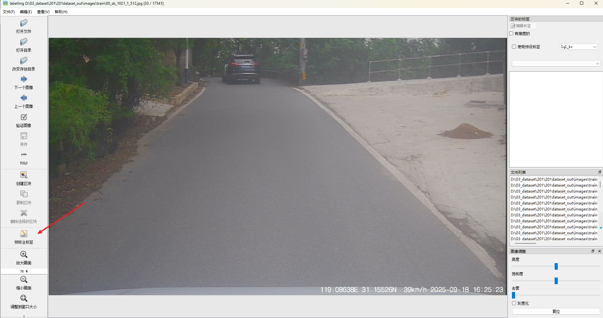
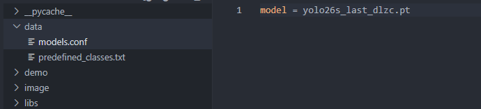
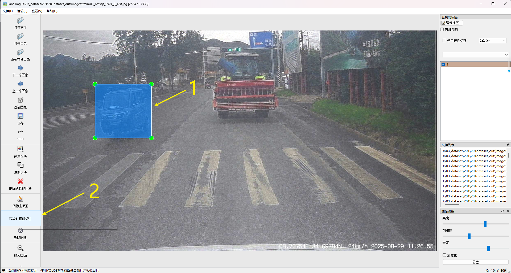

# 功能添加

## 1  预标功能

需要安装ultralytics，以及预训练模型

用预训练模型对图像做预标注



同时修改



python labelimg在当前目录执行或者需要安装

```Shell
pip install ultralytics
```

然后会弹出一个选择预标注范围的框，选择范围，选择类别，就进行预标注目标。

## 2 找特征相似的目标

需要安装ultralytics，以及预训练模型yoloe。

首先选中一个框，然后点击按钮【yoloe 相似标注】



然后会弹出一个选择预标注范围的框，选择范围，就进行找相似度目标，并标注。


## 3 调节图像参数

- 亮度调节
- 饱和度调节
- 去雾化调节
- 灰度化调节
- 复位键


## 4 删除图像

点击删除图像按钮删除当前图像，然后位置退回到下一个图像位置。


