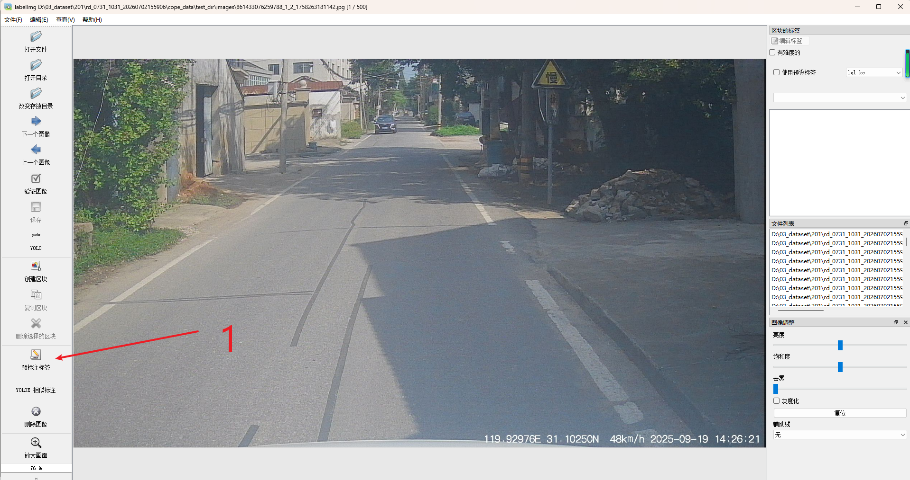
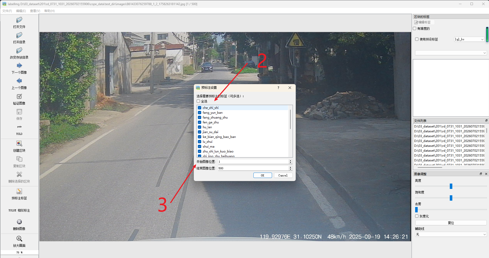
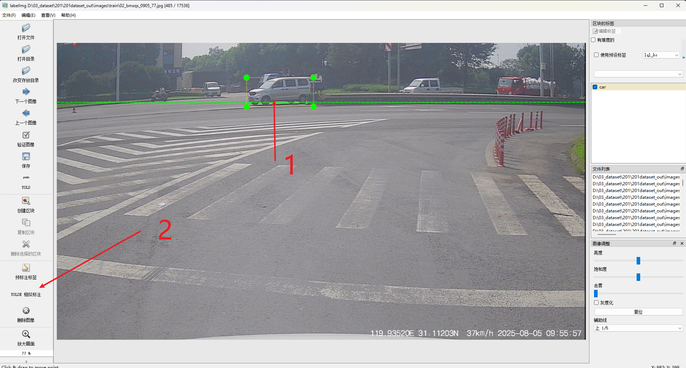
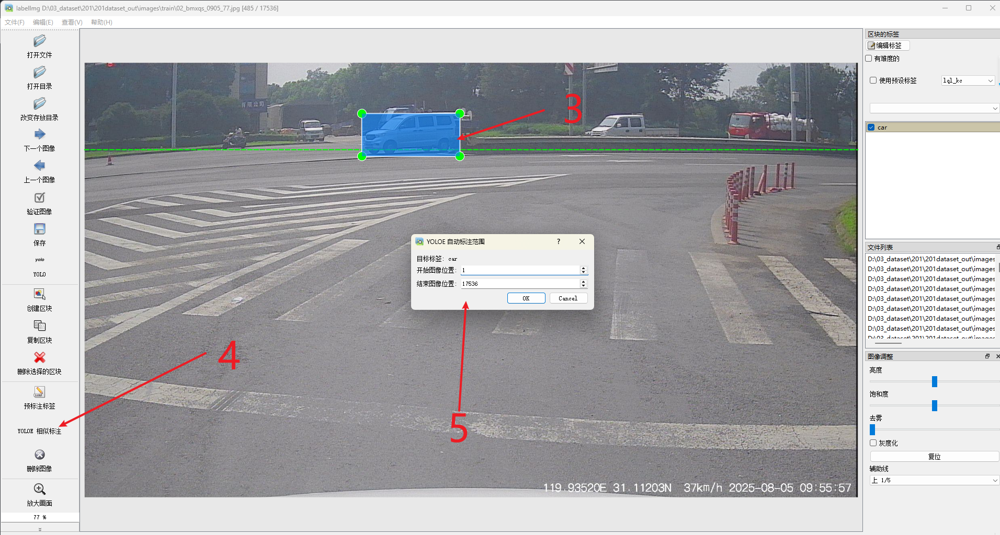
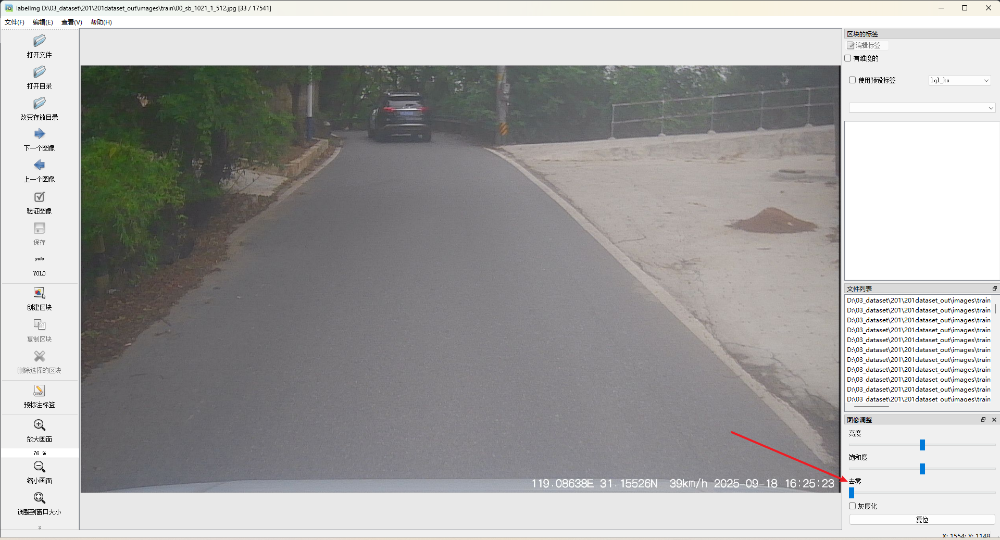
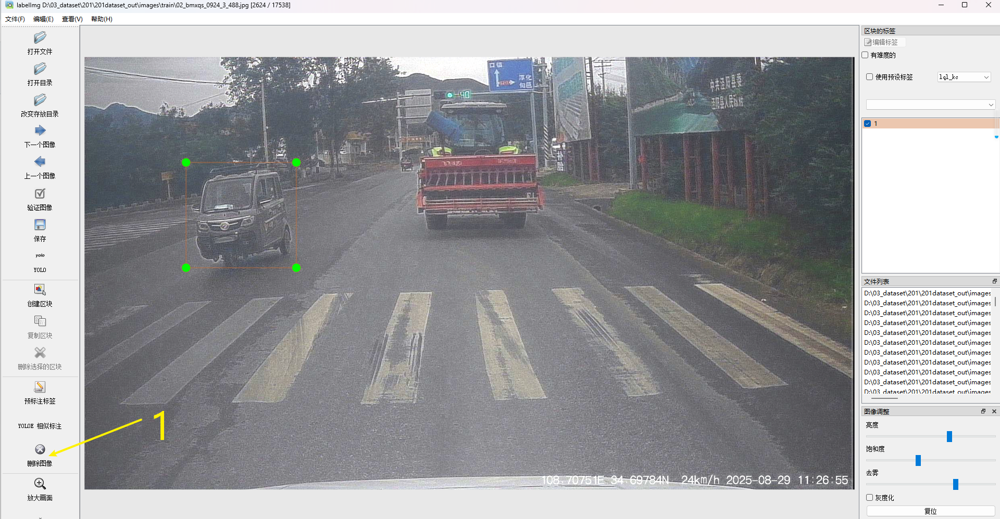
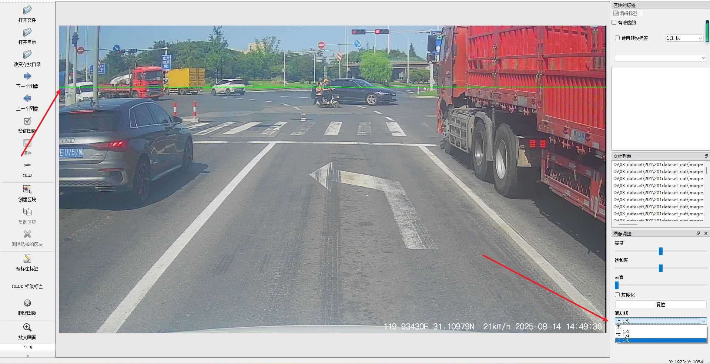

# 功能添加

## 1  预标功能

需要安装ultralytics，以及预训练模型

用预训练模型对图像做预标注



然后会弹出一个选择预标注范围的框，选择范围，选择类别，就进行预标注目标。



配置文件在data/pre_label_models.conf 

```
model = yolo26s_last_dlzc.pt
# 置信度阈值，低于此值的检测结果将被过滤
conf = 0.5
# 输入图像尺寸（像素），可以是单个值（正方形）或宽,高
imgsz = 640
# 运行设备：cpu、cuda:0、mps 等
device = cpu
```


## 2 找特征相似的目标

需要安装ultralytics，以及预训练模型yoloe。

首先选中一个框，然后点击按钮【yoloe 相似标注】



然后会弹出一个选择预标注范围的框，选择范围，就进行找相似度目标，并标注。



## 3 调节图像参数

- 亮度调节
- 饱和度调节
- 去雾化调节
- 灰度化调节
- 复位键



## 4 删除图像

点击删除图像按钮删除当前图像，然后位置退回到下一个图像位置。  



## 5 标准线

当我们需要关注某个范围区域的东西时候，可以使用这个虚线，给我们自己提示。



## 6 点位图像功能
在这个位置，输入文件的名称，不带拓展名字，回车会定位图像位置。


## 7 定位历史标注位置
打开标注图像目录，会自动定位到上次标注的位置。
```bash
python labelimg.py /path/to/images_dir   /path/to/classes.txt

```


